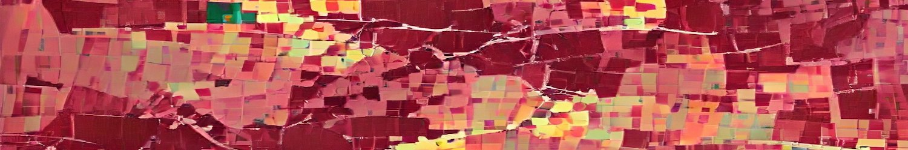

**!!!** Note: This page is **heavily** under construction, so stick with me while I work on it. Until then, visit my current homepage at [http://www.eg.bucknell.edu/~emp017/](http://www.eg.bucknell.edu/~emp017/)
{: .notice}

## About Me

I am an Associate Professor of [Computer Science at Bucknell University](https://www.bucknell.edu/academics/college-engineering/majors-departments/computer-science). I am currently on sabbatical until August 2022, working as a Visiting Scientist at [MIT's Visualization Group](http://vis.csail.mit.edu/) with [Arvind Satyanarayan](https://arvindsatya.com/). My research draws on the fields of [Human-Computer Interaction](https://www.interaction-design.org/literature/book/the-encyclopedia-of-human-computer-interaction-2nd-ed/human-computer-interaction-brief-intro) and [Information Visualization](https://www.interaction-design.org/literature/topics/information-visualization). I believe in _student-centered everything_

-  My research considers the ways in which we are failing to communicate data that serves the public good, and how we can empower more diverse communities through data. I am a co-organizer of [Visualization for Social Good](https://vis4good.github.io/) and my work on [data visualization in rural Pennsylvania](https://medium.com/multiple-views-visualization-research-explained/data-is-personal-what-we-learned-from-42-interviews-in-rural-america-93539f25836d) has been covered extensively in [articles](https://statmodeling.stat.columbia.edu/2019/05/31/data-is-personal-and-the-maturing-of-the-literature-on-statistical-graphics/) and [podcasts](https://datastori.es/data-is-personal-with-evan-peck/).

-  I believe that ethics should be integrated in technical CS classes. I maintain [a website for practice-based responsible CS activities](https://ethicalcs.github.io/), served as a judge for the Mozilla\'s [Responsible CS Challenge](https://foundation.mozilla.org/en/initiatives/responsible-cs/), and have co-organized both workshops and special sections on ethical CS education at [ACM SIGCSE](https://sigcse2019.sigcse.org/).

-   I am an advocate for primarily-undergraduate institutions (PUI). I manage [an email list](https://groups.google.com/forum/#!forum/hciforpui) of HCI professors at PUIs, curate [a website for faculty CS positions at PUIs](https://cs-pui.github.io/), and [write](https://medium.com/bucknell-hci/the-jobs-i-didnt-see-my-misconceptions-of-the-academic-job-market-9cb98b057422) about the [benefits of liberal arts colleges](https://ieeexplore.ieee.org/document/8490181).

-   I see research as a mechanism that should empowers students, and adhere to a [Student-Centered Research Manifesto](https://medium.com/bucknell-hci/a-student-centered-research-manifesto-bfb41072fdca). I [publish](http://www.bucknell.edu/news-and-media/current-news/2017/june/student-researchers-ask-how-secure-we-feel-about-internet-security.html) along undergraduate students (including a [Best Paper Award](https://twitter.com/EvanMPeck/status/1107677854970585088) at [ACM CHI](https://chi2019.acm.org/)!), and serve on the selection committee for [CRA\'s
    Oustanding Undergraduate Researchers award](https://cra.org/about/awards/outstanding-undergraduate-researcher-award/).

For more, visit my [full list of publications](http://www.eg.bucknell.edu/~emp017/projects.html) or the
[occasional blog post](https://medium.com/bucknell-hci/tagged/research) I write about my work.

### What's new
-   Dec: I co-authored a book chapter with Iris Howley and Darakhshan
    Mir for *Ethics of AIED* by Routledge - *Integrating AI Ethics
    Across the Computing Curriculum*. It\'s now off to the presses! -
    more details soon.
-   Dec: Along with colleagues in CS/sociology/philosophy, I created [a
    new resource for integrating ethics/responsibility into existing CS
    curriculum](https://www.bemidjistate.edu/academics/departments/mathematics-computer-science/rcs/module-evaluation/).
    We curated 40+ responsible CS modules, grouped them by topic/class,
    and provided guides to support instructors interested in adopting
    them. This work was funded by
    [Mozilla](https://foundation.mozilla.org/en/what-we-fund/awards/responsible-computer-science-challenge/)
    and led by Marty Wolf and Colleen Greer.
-   Dec: My paper - *1-Hour Collaborative Learning Activity for
    Responsible Human-AI Design* - was *accepted* to a special issue of
    [ACM EngageCSEdu](https://engage-csedu.org/) that focuses on
    Human-Computer Interaction educational resources. More details soon!
-   Nov:I wrote an article about the [hiring practices in CS departments
    at undergraduate
    institutions](https://evanmpeck.medium.com/the-jobs-that-cant-be-seen-the-harm-of-early-job-offers-from-undergraduate-cs-departments-3ee534cd3787),
    and how their early timelines + offers hurt both candidates and
    departments. See the [conversation on Twitter
    here.](https://twitter.com/EvanMPeck/status/1465339662990553091)
-   Nov: The [vis4good workshop](https://vis4good.github.io/) I
    co-organized received a nice call-out as one of the highlights of
    IEEE VIS in [article from Nightingale: Journal of the Data
    Visualization
    Society](https://nightingaledvs.com/highlights-from-ieee-vis-2021/)
    .
-   Nov: Visited with [Harvard HCI](https://hci.seas.harvard.edu/) as
    part of their *Tea with Interesting People* series - we talked about
    data visualization with communities, embedding ethics in CS, and
    research with undergraduate students.
-   Oct: My work integrating ethics into CS 1 courses is featured in
    this [Broadening the
    Circle](https://magazine.bucknell.edu/issue/fall-2021/broadening-the-circle/)
    article by Bucknell Magazine.
-   Oct: Co-organized our 3rd [Visualization for Social
    Good](https://vis4good.github.io/) event - a workshop at [IEEE VIS
    2021](http://ieeevis.org/year/2021/welcome).
-   Oct: It\'s reviewing season for [the Computing Research
    Association\'s Outstanding Undergraduate Researcher
    Awards](https://cra.org/crae/awards/cra-outstanding-undergraduate-researchers/).
    I\'m serving on the selection committee for 2021.
-   Sep: Guest lectured in MIT\'s 6.170 Software Studio course on
    \"Responsible UI Design\" - touching on dark UI patterns, guidelines
    for human-ai interaction, and tactics of soft resistance by UX
    professionals.
-   Sep: Gave [a talk in MIT CSAIL\'s HCI Seminar
    Series](https://calendar.csail.mit.edu/events/239260) - \"Why won\'t
    people listen to data?\"
-   Sep: I begin a 1-year run as Visiting Scientist at [MIT CSAIL\'s
    Visualization Group](http://vis.csail.mit.edu/) with [Arvind
    Satyanarayan](https://arvindsatya.com/)
-   Aug: Concluded my time serving on the [ACM SIGCHI Research Ethics
    Committee](https://sigchi.org/ethics-committee/)
-   Aug: Michelle Kuchera (Davidson) and I ran a 1-day workshop for the
    [PICUP (Patnership for Integration of Computation into Undergraduate
    Physics)](https://www.compadre.org/PICUP/events/2021-Capstone/)
    capstone conference on [Lessons from computer science
    pedagogy](https://www.compadre.org/PICUP/events/2021-Capstone/abstracts/Detail.cfm?id=8662)
-   Aug: I launched an updated website for the 2021/2022 hiring season
    that curates CS Faculty Job Ads for undergraduate institutions:
    <https://cs-pui.github.io/>. See [this twitter
    thread](https://twitter.com/EvanMPeck/status/1422624995050655745)
    for its announcement and updates.
