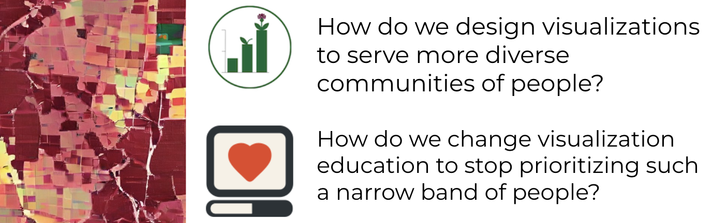

## Recruiting PhD Students for 2025 - Information Visions Lab

📣  **I am planning to accept PhD students for Fall 2025.** This document is meant to help you understand how me, my context, and my research might intersect with your own goals. Choosing a home for your PhD is a big (and difficult) decision. I'm hoping this will help you navigate that space. 
{: .notice--cu}

⚠️ **Before you contact me:** _Read this document carefully_. I have received many emails over the last week from applicants who are primarily interested in ML/AI or Computer Vision. While a subset of our work intersects with ML/AI _applications_ and communicating its impact to diverse populations, my group has **no plans to do research in ML/AI methods or algorithms**. You are better served in a CS department or a with an advisor who specializes in that area.
{: .notice--info}

### What are you interested in? 

**I am looking for Ph.D. students who see the communication of data as an important social issue, and one that can't be disentangled from our communities, our cultures, and our histories.** I believe that data visualization has fallen short in promoting behavior change at a scale needed to confront societal challenges, whether it is encouraging vaccination or demonstrating the urgency of climate change. 

My work explores how we can design visualizations to meet communities where they are _now_, and examines how our implicit beliefs about the places we live, our access to technology, or our experiences undermine our collective ability to respond to data.

### What does the _Information Visions Lab_ focus on? 

The **Information Visions Lab** imagines a future of data communication that prioritizes equity and access. Our research draws on information visualization tools and techniques to empower the ways in which diverse communities can trust, create, and engage with data. _We're still working on your website!_
{: .notice--info}

We are a new research lab that currently has 1 Ph.D. student, 1 Masters student, and 2 BAM students (bachelor + masters). My goal is to bring together a group of researchers that engages with communities to understands our lived experiences with data (even if that isn't a chart or graph). I am interested in projects that have both short-term, and long-term impact - ensuring that the outcomes of our research directly benefit the communities we are working with (see [reciprocal research](https://dl.acm.org/doi/10.1145/3392561.3397585)). My hope is that your interests align with one of these high-level questions: 

- **How do we design data visualizations to serve more diverse communities of people?** I believe that most of the ways in which we have historically chosen to communicate data to communities have failed. What would it mean to rethink our visualization design processes? How can we form a group that not only _researches_ vis for communities, but works _alongside_ them in reimagining data visualization in the future? You can see [some of my work in this space here](https://evanpeck.github.io/projects/publicVis), but if you read just one paper, I'd encourage you to read the [_Data is Personal_ paper](https://evanpeck.github.io/publications/#chi_19_data). 

- **How do we change visualization education to stop prioritizing such a narrow band of people?** In the past, information visualization has largely been insensitive to people's differences in abilities, backgrounds, or cultures. How can we change that? This is extension of [my prior work in ethical computing education here](https://evanpeck.github.io/projects/responsibleCS). 

Members of our lab are currently involved in a number of active projects (at various stages), including: 

- _Bringing Local Perspectives to Geographic Visualizations:_ How can we equip designers and researchers with the tools to generate map visualizations that are sensitive to our understanding of local geography, culture, and identity? 

- _Giving people agency in their interactions with AI:_ How can we help non-technical people understand the benefits and shortcomings of rapid-changing AI models that impact their lives? 

- _Identifying barriers to public visualization communication:_ What barriers do people from diverse geographic locations, socioeconomic backgrounds, or abilities experience when they try to access visualizations on the web? How might this influence or priviledge the ways in which different groups access information? 

- _Health and Visualization_: How can we help young adults learn Type 1 Diabetes management? How can we present complex health information in a way that facilitates positive behavior change? 

You might also want to see my [full publication list](https://evanpeck.github.io/publications) to get a sense of the breadth of projects I have been involved with in the past. 

### What background do I need? 

**Don't filter yourself out** because you feel like you haven't had enough experience or background to do a PhD with me. My research uses both quantitative and qualitative methods, and my projects include both tool-building and interviews. If the ideas here resonate with you, it is likely that your disciplinary background adds value to this space. Some of my most outstanding (and successful) undergraduate researchers in the past were hesitant to apply! And if you're really not sure, feel free to ask me!
{: .notice--info}

I don't see information visualization as just a subfield of computer science (where it has historically been positioned), but a discipline that needs to examine its social and political connections to the world. Our core research community will be [Information Visualization](https://www.interaction-design.org/literature/topics/information-visualization) (and [Human-Computer Interaction](https://www.interaction-design.org/literature/book/the-encyclopedia-of-human-computer-interaction-2nd-ed/human-computer-interaction-brief-intro)), but I also believe that part of our goal as researchers is to understand the _limits_ of our tools, and identify the places where they _aren't_ effective (when and where _shouldn't_ we use data visualizations?). 

For all those reasons, **there is no specific disciplinary requirement**. My hope is that your background intersects deeply with _at least one_ relevant area of research (computation, social science, design, etc.) and that you are _willing to learn_  other areas (if you're in CS, learn some social science/design... if you're in social science, learn some computing). 

### How can I get a sense of your advising? 

This is an important question (and I hope you ask it everywhere you look)! Professionally, the best way to learn about me is to [explore my website](https://evanpeck.github.io/)

As a guiding principle, **I view you as a collaborator**. Practically, that means that our research shouldn't just reflect _my_ interests, but a synthesis of (1) your existing expertise and interests, and (2) the advantages of your context (_e.g._ in an _information science_ program, with my background in _information visualization_). 

I prefer to have weekly 1-on-1 meetings with Ph.D. students, and also a hold a weekly  lab meeting that I expect you to attend. Your first year experience will vary depending on your background! If you enter the program with a clear vision that aligns with the goals of the lab, we'll start right away on a project of your choosing. However, I find that most new graduate students benefit from being integrated into existing projects _first_, while you get a better sense of research norms + expectations in HCI/Visualization, and also gain a stronger intuition for impactful questions (both for the research field, and more broadly!). 

Because I think there is a strong relationship between teaching philosophies and advising philosophies, it might also help you to read some old articles I've written in that space: 
- While you'll help me develop the _Information Visions_ group, this isn't my first time advising research. I have publicized my philosophy for performing research alongside students for years, and you can read my [student-centered research manifesto](https://medium.com/bucknell-hci/a-student-centered-research-manifesto-bfb41072fdca). 

- [The Fear of Publicly Not Knowing](https://medium.com/bucknell-hci/the-fear-of-publicly-not-knowing-239e1b7a39f3): tl;dr is that I don't expect you to know everything, but that I hope we can foster a professional relationship that allows us to feel comfortable exposing those gaps in our knowledge to improve our research. 

You should also know that **I have am supportive of diverse careers in either industry or academia**. I have written about [aligning personal priorities with the jobs we seek in academia](https://medium.com/bucknell-hci/the-jobs-i-didnt-see-my-misconceptions-of-the-academic-job-market-9cb98b057422), and I curate a [job ad website](https://cs-pui.github.io/). My own story has been non-linear within academia, and I've considered positions as far ranging as R1s, to liberal arts colleges (where I've worked before), to teaching-track positions. 

Finally, I am also a big advocate of community. I will connect you with researchers in the field that I think will help you, and our lab will hold social events with other groups at CU. 

There is more to write about advising than space practically allows, but [feel free to email me](mailto:evan.peck@colorado.edu)

### Why should I choose Information Science? 

> _Love people? Love technology? You’ll fit in perfectly. Information science is the study of the relationships between people, places and technology and how they are intertwined. Our data-driven, interdisciplinary approach—drawing on social science, computer science and the humanities—allows students to develop the conceptual understanding and practical skills needed to succeed in a future characterized by new ways of working, communicating and creating. A degree in information science enables students to imagine what technology makes possible, invent new ways to use technology and positively impact the world._ - [CU Information Science homepage](https://www.colorado.edu/cmci/infoscience)

If you've looked around at other Information Visualization profs, you might notice that many of them are situated in computer science departments (I used to be in a CS department too). I find that information science is a new area for many people. So here is _my_ rationale of why I moved to an Information Science department. 

**I made a deliberate switch from Computer Science to Information Science because I believe that it is a disciplinary space that is better equipped to tackle some of the deeply challenging intersections between technology and society**. Practically, you shouldn't expect the same computational depth as Computer Science in the core curriculum (although you can certainly take those classes!). Instead, you will find a different prioritization - rich intersections with the social sciences and humanities, understandings of how design impacts communities, and a value on _both_ quantitative and qualitative methods. 

While this differs from a PhD in CS, as an advisor to Computer Science undergraduates for 9 years, I also know that I was not alone in searching for programs that might be oriented in towards prioritizing tech _in service to_ society. Information Science provided that alignment for me (but know that departments and institutions differ!). 

To explore yourself, I'd encourage you to look through the research and backgrounds of the [faculty](https://www.colorado.edu/cmci/people/information-science), their [research labs](https://www.colorado.edu/cmci/infoscience/labs), and [the graduate students in the Information Science department at CU](https://www.colorado.edu/cmci/people/graduate-students/information-science-grad-students). They are the best reflection of the kind of scholarly community you'll be entering - both in terms of what kind of work we do, but also in terms of who you get to spend time with and learn from. Our faculty and students have backgrounds in political science, computer science, law, design, education, communication, human-centered computing, and more, and more, and more. 

They are a lovely group of people, and a large part of why I chose to make CU Boulder Information Science my new home. 

### What are the next steps? 

- [Familiarize yourself more with the program](https://www.colorado.edu/cmci/infoscience/phd), the [FAQ](https://www.colorado.edu/cmci/infoscience/gd/faq), and [PhD requirements](https://www.colorado.edu/cmci/infoscience/phd#req) to make sure Information Science is right for you. **The deadline for PhD applications is December 1st, 2024**
- Feel free to email me if you have any questions or want to chat more about the research group I'm hoping to build: `evan.peck@colorado.edu`

I do my best to respond to all prospective PhD student emails, but the practical reality is that I do not have the ability to have 1-on-1 conversations with every student that emails me! If I don't respond immediately _don't interpret this as a signal that I'm not interested_. Please feel comfortable reminding me after a week or so. 
{: .notice--info}